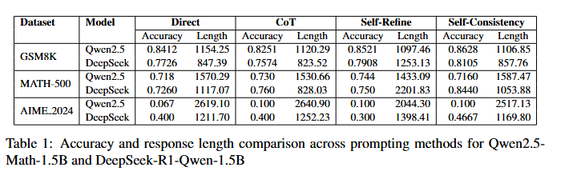

# LLMathrix - A Testing Framework for Mathematical Ability of LLMs
LLMathrix is a testing framework for evaluating the mathematical ability of Large Language Models (LLMs). 
It uses a set of mathematical tasks and questions with different levels of difficulty to test the LLM's ability to perform complex mathematical calculations and solve problems.

This is a course project of CS6493 at City University of Hong Kong.
## Approach
Rather than fine-tune the LLM, in this framework we try to use a more easy approach to evaluate the LLM's ability to perform mathematical tasks, and that's **Prompt Engineering**. Each model are tested by three different methods, including
**chain of thought (CoT)**, **self-refine**, and **self-consistency**.

## Models
Two models are used, [Qwen2.5-Math-1.5B](https://bailian.console.aliyun.com/?tab=model#/model-market/detail/qwen2.5-math-1.5b-instruct) and [DeepSeek-R1-Qwen-1.5B](https://bailian.console.aliyun.com/?tab=model#/efm/model_experience_center/text?currentTab=textChat&modelId=deepseek-r1-distill-qwen-1.5b).

The first model is fine-tuning with a large amount of mathematical tasks and questions, and the second model is a distilled model but for general questions. They both have a small number of parameters, so the mathematical ability of these models should be comparable and the effect the prompt engineering has on the model's performance should be significant.

## Datasets
We use a set of mathematical tasks and questions with different levels of difficulty to test the LLM's ability to perform complex mathematical calculations and solve problems.
The datasets are from Hugging Face, and they are [GSM8K](https://huggingface.co/datasets/openai/gsm8k), [MATH-500](https://huggingface.co/datasets/HuggingFaceH4/MATH-500), and [AIME_2024](https://huggingface.co/datasets/HuggingFaceH4/aime_2024).
The difficulty level of these datasets varies from easy to hard, and the number of tasks and questions in each dataset varies.

## Evaluation
Evaluation is performed by calculating the accuracy of the LLM's predictions. We compare the answer the LLM gives under different methods to the ground truth answer to get if the model's prediction is correct.

However, as said before, the parameters of the models are small, so the answer the LLM gives is not always exactly the same as the ground truth, and by simply **pattern matching**, it sometimes gives a wrong result, that is, the answer is right but the matching result says it is wrong.

eg. the answer the LLM gives is *so the answer is 1 + 1 = 2*, but the ground truth is simply *2*, so with pattern matching, it will say the answer is wrong.

So besides pattern matching, we also use a lagre parameter model, called **judge LLM**, to judge the answer the Mathematical LLM gives and compare with the ground truth.
We choose [ChatGPT-4o](https://openai.com/index/hello-gpt-4o/) for our judge LLM. The judge LLM can judge the answer like in the example and gives the correct judge result.

LLM-as-a-Judge is a hot topic and there are many papers about it, like [A Survey on LLM-as-a-Judge](https://arxiv.org/abs/2411.15594), which gives a conduct on this topic and discusses the reliability of the LLM-as-a-Judge, and we think it's the most important concern about this method.

## Usage
First you need to install the required packages:

```pip install -r requirements.txt```

Models to be tested are obtained from [Aliyun Bai Lian (百炼)](https://bailian.console.aliyun.com/?tab=home#/home) platform, so you need to register an account and get the **access api key** and **model base url**.

You also need to get the **judge LLM** api key and model base url, like in [OpenAI API Platform](https://openai.com/api/).

After all these steps, simply run the following command:

```python main.py```

## Results


From Table 1 we can see that with the level of difficulty, the accuracy of the LLM's predictions decreases. Different approaches can help improve the accuracy of the LLM's predictions, and the best approach is **self-consistency**.

But all in all, the best approach is to use a more powerful model :joy:.

## Dependencies
- [X] Numpy
- [X] Pandas
- [X] Hugging Face Datasets
- [X] OpenAI